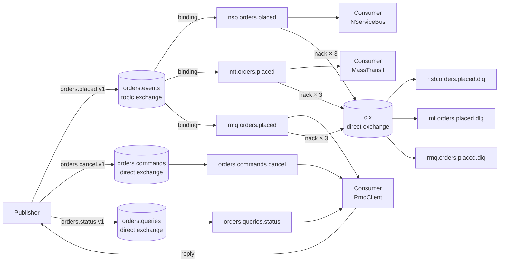

# Messaging — broker-agnostic messaging on RabbitMQ

A .NET 10 monorepo demonstrating a **broker-agnostic messaging architecture** on top of RabbitMQ. A single contracts library owns all message types; three independent consumers receive them using NServiceBus, MassTransit, and the raw RabbitMQ.Client.

## Message flow



## Quick start

```bash
# Prerequisites: .NET 10 SDK, Docker, Aspire workload
dotnet workload install aspire

dotnet run --project aspire/Messaging.AppHost
```

The Aspire dashboard opens at `http://localhost:18888`. The RabbitMQ management UI is at `http://localhost:15672` (guest/guest).

## Solution layout

```
src/
  Messaging.Contracts/          # Zero-dep contracts — IEvent, ICommand, IQuery<T>
  Messaging.Infrastructure/     # Topology helpers, serialization, publisher
  Messaging.Publisher/          # Demo publisher Worker Service
  Messaging.Consumer.NServiceBus/
  Messaging.Consumer.MassTransit/
  Messaging.Consumer.RmqClient/
aspire/
  Messaging.AppHost/            # Aspire orchestration
  Messaging.ServiceDefaults/    # Shared OTel + Serilog defaults
tests/
  Messaging.Contracts.Tests/    # xUnit — topology, versioning, correlation
docs/adr/                       # Architecture Decision Records
```

## Architecture decisions

See [docs/adr/README.md](docs/adr/README.md) for the full ADR index.
