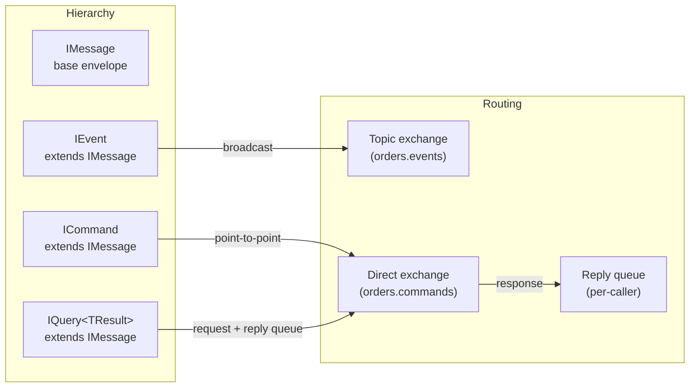
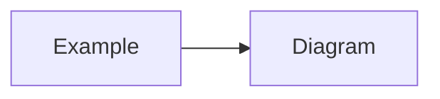
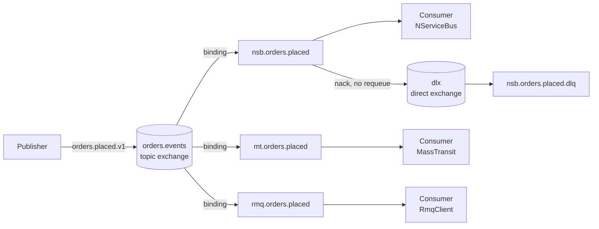
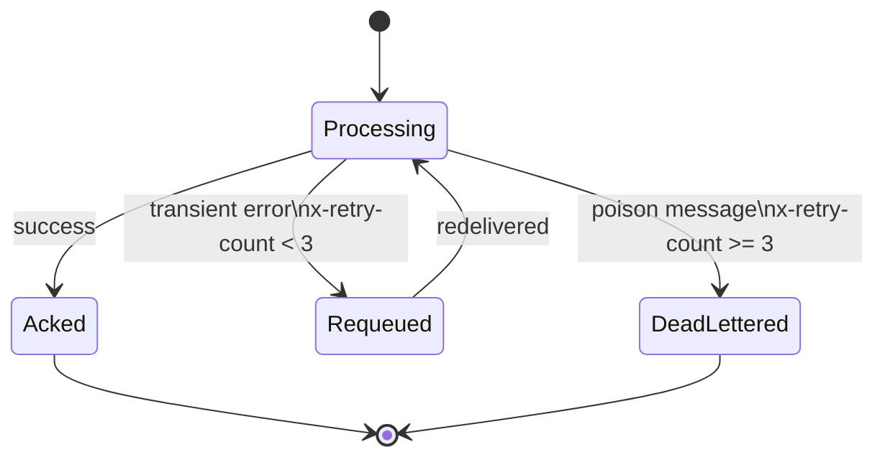

# Messaging solution — Claude Code specification

## Context & objective

Build a .NET 10 monorepo solution that demonstrates a **broker-agnostic messaging architecture** on top of RabbitMQ.
A single NuGet-style class library (`Messaging.Contracts`) owns all message types, routing keys, and exchange names.
Three independent consumer projects consume those contracts each using a different messaging framework:
- **NServiceBus** (Particular Software)
- **MassTransit** (community OSS)
- **RabbitMQ.Client** (raw AMQP, no framework)

A **.NET Aspire AppHost** orchestrates the full environment locally: RabbitMQ broker, a publisher demo service, the three consumer demo services, and an observability stack (Seq for structured logs + OpenTelemetry).

---

## Toolchain & SDK versions

| Tool | Version / constraint |
|---|---|
| .NET SDK | 10.0 |
| Aspire AppHost SDK | `Aspire.AppHost.Sdk` **13.2.0** |
| Aspire ServiceDefaults | `Aspire.Hosting` matching 13.2.0 |
| RabbitMQ.Client | 7.x |
| MassTransit.RabbitMQ | 8.x |
| NServiceBus | 9.x |
| NServiceBus.RabbitMQ | 9.x |
| Seq (local) | via Aspire `AddSeq()` |
| Central package management | **Directory.Packages.props** (CPM enabled) |

All `<PackageReference>` elements across every `.csproj` must have **no `Version` attribute** — versions live exclusively in `Directory.Packages.props`.

---

## Repository layout

```
/
├── Directory.Packages.props          ← central package versions (CPM)
├── Directory.Build.props             ← shared MSBuild properties
├── global.json                       ← pins .NET SDK version
├── Messaging.sln
│
├── src/
│   ├── Messaging.Contracts/          ← zero framework deps
│   │   ├── Orders/                   ← domain message records
│   │   ├── Topology/                 ← exchange, routing key, queue constants
│   │   └── Versioning/               ← ContractVersion attribute · ContractVersions · validator
│   ├── Messaging.Infrastructure/     ← topology helpers, serialization
│   ├── Messaging.Publisher/          ← demo publisher (Worker Service)
│   │
│   ├── Messaging.Consumer.NServiceBus/   ← NServiceBus consumer (Worker Service)
│   ├── Messaging.Consumer.MassTransit/   ← MassTransit consumer (Worker Service)
│   └── Messaging.Consumer.RmqClient/     ← raw RabbitMQ.Client consumer (Worker Service)
│
├── aspire/
│   ├── Messaging.AppHost/            ← Aspire AppHost project
│   └── Messaging.ServiceDefaults/    ← shared Aspire service defaults
│
├── docs/
│   └── adr/                          ← Architecture Decision Records (MADR format)
│       ├── README.md                 ← ADR index
│       ├── 0000-template.md          ← blank template for new ADRs
│       ├── 0001-agnostic-contract-package.md
│       ├── 0002-rabbitmq-sole-broker.md
│       ├── 0003-topic-exchange-header-type-routing.md
│       ├── 0004-central-package-management.md
│       ├── 0005-quorum-queues-dead-letter.md
│       ├── 0006-aspire-local-orchestration.md
│       ├── 0007-system-text-json-serialization.md
│       └── 0008-versioning-routing-key-suffix.md
│
└── tests/
    └── Messaging.Contracts.Tests/    ← contract shape & routing key tests (xUnit)
```

---

## Central package management

### `global.json`

```json
{
  "sdk": {
    "version": "10.0.201",
    "rollForward": "latestPatch"
  }
}
```

### `Directory.Build.props`

```xml
<Project>
  <PropertyGroup>
    <TargetFramework>net10.0</TargetFramework>
    <Nullable>enable</Nullable>
    <ImplicitUsings>enable</ImplicitUsings>
    <TreatWarningsAsErrors>true</TreatWarningsAsErrors>
    <ManagePackageVersionsCentrally>true</ManagePackageVersionsCentrally>
  </PropertyGroup>
</Project>
```

### `Directory.Packages.props`

```xml
<Project>
  <PropertyGroup>
    <ManagePackageVersionsCentrally>true</ManagePackageVersionsCentrally>
  </PropertyGroup>

  <ItemGroup Label="Aspire">
    <PackageVersion Include="Aspire.Hosting"                           Version="8.2.2" />
    <PackageVersion Include="Aspire.Hosting.RabbitMQ"                  Version="8.2.2" />
    <PackageVersion Include="Aspire.Hosting.Seq"                       Version="8.2.2" />
    <PackageVersion Include="Aspire.RabbitMQ.Client"                   Version="8.2.2" />
    <PackageVersion Include="Microsoft.Extensions.Hosting"             Version="8.0.1" />
    <PackageVersion Include="Microsoft.Extensions.Hosting.Abstractions" Version="8.0.1" />
  </ItemGroup>

  <ItemGroup Label="RabbitMQ">
    <PackageVersion Include="RabbitMQ.Client"                          Version="7.1.2" />
  </ItemGroup>

  <ItemGroup Label="MassTransit">
    <PackageVersion Include="MassTransit"                              Version="8.3.3" />
    <PackageVersion Include="MassTransit.RabbitMQ"                     Version="8.3.3" />
  </ItemGroup>

  <ItemGroup Label="NServiceBus">
    <PackageVersion Include="NServiceBus"                              Version="9.2.0" />
    <PackageVersion Include="NServiceBus.RabbitMQ"                     Version="9.1.0" />
    <PackageVersion Include="NServiceBus.Extensions.Hosting"           Version="3.0.0" />
  </ItemGroup>

  <ItemGroup Label="Observability">
    <PackageVersion Include="OpenTelemetry.Exporter.OpenTelemetryProtocol" Version="1.9.0" />
    <PackageVersion Include="OpenTelemetry.Extensions.Hosting"         Version="1.9.0" />
    <PackageVersion Include="OpenTelemetry.Instrumentation.Runtime"    Version="1.9.0" />
    <PackageVersion Include="Serilog.Extensions.Hosting"               Version="8.0.0" />
    <PackageVersion Include="Serilog.Sinks.OpenTelemetry"              Version="4.0.0" />
  </ItemGroup>

  <ItemGroup Label="Serialization">
    <PackageVersion Include="Microsoft.Extensions.Options"             Version="8.0.2" />
  </ItemGroup>

  <ItemGroup Label="Tests">
    <PackageVersion Include="Microsoft.NET.Test.Sdk"                   Version="17.11.1" />
    <PackageVersion Include="xunit"                                    Version="2.9.2" />
    <PackageVersion Include="xunit.runner.visualstudio"                Version="2.8.2" />
    <PackageVersion Include="FluentAssertions"                         Version="6.12.1" />
  </ItemGroup>
</Project>
```

> **Constraint**: Every `<PackageReference>` in every `.csproj` must omit the `Version` attribute.
> The build will fail with `NU1604` if any project pins its own version.

---

## Project definitions

### `Messaging.Contracts` — no framework dependencies

```xml
<!-- src/Messaging.Contracts/Messaging.Contracts.csproj -->
<Project Sdk="Microsoft.NET.Sdk">
  <PropertyGroup>
    <AssemblyName>Messaging.Contracts</AssemblyName>
  </PropertyGroup>
  <!-- ZERO PackageReference items allowed here -->
</Project>
```

**Hard rule**: CI must verify that `Messaging.Contracts.csproj` contains no `<PackageReference>` items.
Add this target to `Directory.Build.props` to enforce it at build time:

```xml
<Target Name="EnforceContractsPurity" BeforeTargets="Build"
        Condition="'$(MSBuildProjectName)' == 'Messaging.Contracts'">
  <Error Condition="'@(PackageReference)' != ''"
         Text="Messaging.Contracts must not reference any NuGet package." />
</Target>
```

### `Messaging.Infrastructure`

```xml
<Project Sdk="Microsoft.NET.Sdk">
  <ItemGroup>
    <ProjectReference Include="../Messaging.Contracts/Messaging.Contracts.csproj" />
    <PackageReference Include="RabbitMQ.Client" />
    <PackageReference Include="Microsoft.Extensions.Options" />
  </ItemGroup>
</Project>
```

### `Messaging.Publisher`

```xml
<Project Sdk="Microsoft.NET.Sdk.Worker">
  <ItemGroup>
    <ProjectReference Include="../Messaging.Infrastructure/Messaging.Infrastructure.csproj" />
    <ProjectReference Include="../../aspire/Messaging.ServiceDefaults/Messaging.ServiceDefaults.csproj" />
    <PackageReference Include="Aspire.RabbitMQ.Client" />
    <PackageReference Include="Microsoft.Extensions.Hosting" />
  </ItemGroup>
</Project>
```

### `Messaging.Consumer.NServiceBus`

```xml
<Project Sdk="Microsoft.NET.Sdk.Worker">
  <ItemGroup>
    <ProjectReference Include="../Messaging.Infrastructure/Messaging.Infrastructure.csproj" />
    <ProjectReference Include="../../aspire/Messaging.ServiceDefaults/Messaging.ServiceDefaults.csproj" />
    <PackageReference Include="NServiceBus" />
    <PackageReference Include="NServiceBus.RabbitMQ" />
    <PackageReference Include="NServiceBus.Extensions.Hosting" />
  </ItemGroup>
</Project>
```

### `Messaging.Consumer.MassTransit`

```xml
<Project Sdk="Microsoft.NET.Sdk.Worker">
  <ItemGroup>
    <ProjectReference Include="../Messaging.Infrastructure/Messaging.Infrastructure.csproj" />
    <ProjectReference Include="../../aspire/Messaging.ServiceDefaults/Messaging.ServiceDefaults.csproj" />
    <PackageReference Include="MassTransit" />
    <PackageReference Include="MassTransit.RabbitMQ" />
  </ItemGroup>
</Project>
```

### `Messaging.Consumer.RmqClient`

```xml
<Project Sdk="Microsoft.NET.Sdk.Worker">
  <ItemGroup>
    <ProjectReference Include="../Messaging.Infrastructure/Messaging.Infrastructure.csproj" />
    <ProjectReference Include="../../aspire/Messaging.ServiceDefaults/Messaging.ServiceDefaults.csproj" />
    <PackageReference Include="RabbitMQ.Client" />
  </ItemGroup>
</Project>
```

### `Messaging.AppHost`

```xml
<Project Sdk="Aspire.AppHost.Sdk/8.2.2">
  <ItemGroup>
    <PackageReference Include="Aspire.Hosting.RabbitMQ" />
    <PackageReference Include="Aspire.Hosting.Seq" />
  </ItemGroup>
  <ItemGroup Label="Service references">
    <ProjectReference Include="../../src/Messaging.Publisher/Messaging.Publisher.csproj" />
    <ProjectReference Include="../../src/Messaging.Consumer.NServiceBus/Messaging.Consumer.NServiceBus.csproj" />
    <ProjectReference Include="../../src/Messaging.Consumer.MassTransit/Messaging.Consumer.MassTransit.csproj" />
    <ProjectReference Include="../../src/Messaging.Consumer.RmqClient/Messaging.Consumer.RmqClient.csproj" />
  </ItemGroup>
</Project>
```

### `Messaging.ServiceDefaults`

```xml
<Project Sdk="Microsoft.NET.Sdk">
  <ItemGroup>
    <PackageReference Include="Aspire.Hosting" />
    <PackageReference Include="OpenTelemetry.Extensions.Hosting" />
    <PackageReference Include="OpenTelemetry.Exporter.OpenTelemetryProtocol" />
    <PackageReference Include="OpenTelemetry.Instrumentation.Runtime" />
    <PackageReference Include="Serilog.Extensions.Hosting" />
    <PackageReference Include="Serilog.Sinks.OpenTelemetry" />
  </ItemGroup>
</Project>
```

> Every Worker Service project (`Messaging.Publisher`, `Messaging.Consumer.*`) must add a `ProjectReference` to `ServiceDefaults`:
>
> ```xml
> <ProjectReference Include="../../aspire/Messaging.ServiceDefaults/Messaging.ServiceDefaults.csproj" />
> ```
>
> This is what makes `builder.AddServiceDefaults()` available in each `Program.cs`.

---

## Messaging concepts — theory

Before the source definitions, understand why each interface exists:

| Concept | Interface | Direction | Consumers | Exchange type | Intent |
|---|---|---|---|---|---|
| **Event** | `IEvent` | 1 → N (broadcast) | Many (fan-out) | Topic | "Something happened" — past tense, no expectation of response |
| **Command** | `ICommand` | 1 → 1 (point-to-point) | Exactly one | Direct | "Do this" — imperative, one owner handles it |
| **Query** | `IQuery<TResult>` | 1 → 1 (request/reply) | Exactly one | Direct + reply queue | "Give me data" — expects a synchronous-ish response |
| **Message** | `IMessage` | Infrastructure base | N/A | N/A | Shared envelope metadata (id, correlation, timestamp, version) |



**Key rules:**
- Events use a **topic exchange** — any number of consumers can bind and receive a copy independently.
- Commands use a **direct exchange** — exactly one service owns and processes the command. Sending the same command to two queues is an architecture smell.
- Queries are commands that expect a reply. In RabbitMQ this uses the `reply-to` AMQP property and a temporary exclusive reply queue. Use sparingly — if a query crosses a service boundary frequently, consider exposing a REST endpoint instead.

---

## Messaging.Contracts — source

### Contract folder structure

```
src/Messaging.Contracts/
├── IMessage.cs               ← base envelope interface
├── IEvent.cs                 ← marker for domain events
├── ICommand.cs               ← marker for commands
├── IQuery.cs                 ← marker for request/reply queries
│
├── Orders/
│   ├── Events/
│   │   ├── OrderPlaced.cs        ← IEvent demo
│   │   └── OrderCancelled.cs     ← IEvent demo
│   ├── Commands/
│   │   └── CancelOrder.cs        ← ICommand demo
│   └── Queries/
│       └── GetOrderStatus.cs     ← IQuery<T> demo
│
├── Topology/
│   ├── Exchanges.cs
│   ├── RoutingKeys.cs
│   └── Queues.cs
│
└── Versioning/
    ├── ContractVersionAttribute.cs
    ├── ContractVersions.cs
    └── ContractVersionValidator.cs
```

---

### `IMessage.cs`

```csharp
namespace Messaging.Contracts;

/// <summary>
/// Base envelope carried by every message type.
/// Not used directly in consumer handlers — use IEvent, ICommand, or IQuery&lt;TResult&gt;.
/// </summary>
public interface IMessage
{
    /// <summary>Unique identifier for this message instance.</summary>
    Guid MessageId { get; }

    /// <summary>
    /// Correlation identifier propagated across all messages in the same
    /// logical operation. Sourced from Activity.TraceId when available.
    /// Carried in both the JSON payload and the x-correlation-id AMQP header.
    /// A consumer that publishes a downstream message MUST propagate this value,
    /// never generate a new one.
    /// </summary>
    string CorrelationId { get; }

    /// <summary>UTC timestamp of when this message was created.</summary>
    DateTimeOffset OccurredOn { get; }

    /// <summary>Schema version of this contract. See ADR-0010.</summary>
    int SchemaVersion { get; }
}
```

### `IEvent.cs`

```csharp
namespace Messaging.Contracts;

/// <summary>
/// Marker interface for domain events.
///
/// Semantics: "something happened" — past tense, immutable fact.
/// The publisher does not know or care who consumes it.
///
/// Routing: topic exchange, fan-out to N consumer queues.
/// One event can be received by multiple independent consumers simultaneously.
///
/// Naming convention: past participle noun — OrderPlaced, PaymentFailed, UserRegistered.
/// </summary>
public interface IEvent : IMessage { }
```

### `ICommand.cs`

```csharp
namespace Messaging.Contracts;

/// <summary>
/// Marker interface for commands.
///
/// Semantics: "do this" — imperative, directed at a specific service.
/// Exactly one consumer owns and handles each command type.
/// Sending the same command type to more than one queue is an architecture error.
///
/// Routing: direct exchange, point-to-point to a single named queue.
///
/// Naming convention: imperative verb + noun — CancelOrder, ProcessPayment, SendEmail.
/// </summary>
public interface ICommand : IMessage { }
```

### `IQuery.cs`

```csharp
namespace Messaging.Contracts;

/// <summary>
/// Marker interface for request/reply queries.
///
/// Semantics: "give me data" — expects a response on a reply queue.
/// Use the AMQP reply-to property to carry the caller's reply queue name.
/// The handler publishes the result back to that queue.
///
/// Routing: direct exchange + ephemeral exclusive reply queue per caller.
///
/// Use sparingly: if a query crosses a service boundary on every request,
/// a synchronous REST/gRPC call may be more appropriate.
///
/// Naming convention: Get/Find/Check + noun — GetOrderStatus, FindCustomer.
/// </summary>
public interface IQuery<TResult> : IMessage { }
```

---

### Events — `Orders/Events/`

```csharp
// Orders/Events/OrderPlaced.cs
namespace Messaging.Contracts.Orders.Events;

using Messaging.Contracts.Versioning;

/// <summary>
/// Raised when an order has been successfully placed and persisted.
/// Consumed by: invoicing service, warehouse service, notification service.
/// </summary>
[ContractVersion(ContractVersions.OrderPlaced)]
public sealed record OrderPlaced(
    Guid           MessageId,
    string         CorrelationId,
    DateTimeOffset OccurredOn,
    int            SchemaVersion,
    Guid           OrderId,
    Guid           CustomerId,
    decimal        TotalAmount,
    string         Currency
) : IEvent;
```

```csharp
// Orders/Events/OrderCancelled.cs
namespace Messaging.Contracts.Orders.Events;

using Messaging.Contracts.Versioning;

/// <summary>
/// Raised when an order has been cancelled for any reason.
/// Consumed by: invoicing service (void invoice), warehouse (release stock).
/// </summary>
[ContractVersion(ContractVersions.OrderCancelled)]
public sealed record OrderCancelled(
    Guid           MessageId,
    string         CorrelationId,
    DateTimeOffset OccurredOn,
    int            SchemaVersion,
    Guid           OrderId,
    string         Reason
) : IEvent;
```

---

### Command — `Orders/Commands/`

```csharp
// Orders/Commands/CancelOrder.cs
namespace Messaging.Contracts.Orders.Commands;

using Messaging.Contracts.Versioning;

/// <summary>
/// Instructs the order service to cancel a specific order.
/// Exactly ONE consumer handles this — the order service.
/// After processing, the handler publishes an OrderCancelled event.
///
/// Routing: direct exchange orders.commands → queue orders.commands.cancel
/// </summary>
[ContractVersion(ContractVersions.CancelOrder)]
public sealed record CancelOrder(
    Guid           MessageId,
    string         CorrelationId,
    DateTimeOffset OccurredOn,
    int            SchemaVersion,
    Guid           OrderId,
    string         RequestedBy,
    string         Reason
) : ICommand;
```

---

### Query — `Orders/Queries/`

```csharp
// Orders/Queries/GetOrderStatus.cs
namespace Messaging.Contracts.Orders.Queries;

using Messaging.Contracts.Versioning;

/// <summary>
/// Requests the current status of an order.
/// The handler replies with OrderStatusResult on the AMQP reply-to queue.
///
/// Routing: direct exchange orders.queries → queue orders.queries.status
/// Response: published to BasicProperties.ReplyTo with the same CorrelationId.
/// </summary>
[ContractVersion(ContractVersions.GetOrderStatus)]
public sealed record GetOrderStatus(
    Guid           MessageId,
    string         CorrelationId,
    DateTimeOffset OccurredOn,
    int            SchemaVersion,
    Guid           OrderId
) : IQuery<OrderStatusResult>;

/// <summary>
/// Reply payload for GetOrderStatus. Not an IMessage — it is a plain DTO
/// sent directly to the caller's reply queue, not published to an exchange.
/// </summary>
public sealed record OrderStatusResult(
    Guid   OrderId,
    string Status,       // e.g. "Pending", "Confirmed", "Cancelled", "Shipped"
    string CorrelationId // echoed back so the caller can match the response
);
```

---

### Versioning — `Versioning/`

```csharp
// Versioning/ContractVersionAttribute.cs
namespace Messaging.Contracts.Versioning;

[AttributeUsage(AttributeTargets.Class, Inherited = false)]
public sealed class ContractVersionAttribute(int version) : Attribute
{
    public int Version { get; } = version;
}
```

```csharp
// Versioning/ContractVersions.cs
namespace Messaging.Contracts.Versioning;

/// <summary>
/// Single source of truth for all schema version numbers.
/// Update here + on the [ContractVersion] attribute whenever a version increments.
/// See ADR-0008 and ADR-0010.
/// </summary>
public static class ContractVersions
{
    // Events
    public const int OrderPlaced    = 1;
    public const int OrderCancelled = 1;

    // Commands
    public const int CancelOrder    = 1;

    // Queries
    public const int GetOrderStatus = 1;
}
```

```csharp
// Versioning/ContractVersionValidator.cs
namespace Messaging.Contracts.Versioning;

using System.Reflection;

/// <summary>
/// Startup guard: fails fast if any IMessage implementation is missing
/// a [ContractVersion] attribute. Call before host.Run() in every service.
/// </summary>
public static class ContractVersionValidator
{
    public static void AssertAllVersioned()
    {
        var violations = typeof(IMessage).Assembly
            .GetTypes()
            .Where(t => t.IsClass && !t.IsAbstract && typeof(IMessage).IsAssignableFrom(t))
            .Where(t => t.GetCustomAttribute<ContractVersionAttribute>() is null)
            .Select(t => t.FullName!)
            .ToList();

        if (violations.Count > 0)
            throw new InvalidOperationException(
                "The following contract types are missing [ContractVersion]: " +
                string.Join(", ", violations));
    }
}
```

---

### Topology — `Topology/`

```csharp
// Topology/Exchanges.cs
namespace Messaging.Contracts.Topology;

public static class Exchanges
{
    /// <summary>Topic exchange — events fan out to N consumer queues.</summary>
    public const string OrderEvents   = "orders.events";

    /// <summary>Direct exchange — commands routed to exactly one queue.</summary>
    public const string OrderCommands = "orders.commands";

    /// <summary>Direct exchange — queries routed to exactly one queue.</summary>
    public const string OrderQueries  = "orders.queries";

    /// <summary>Global dead-letter exchange (direct).</summary>
    public const string DeadLetter    = "dlx";
}
```

```csharp
// Topology/RoutingKeys.cs
namespace Messaging.Contracts.Topology;

public static class RoutingKeys
{
    // Events (topic exchange — supports wildcard bindings)
    public const string OrderPlaced    = "orders.placed.v1";
    public const string OrderCancelled = "orders.cancelled.v1";

    // Commands (direct exchange — exact match only)
    public const string CancelOrder    = "orders.cancel.v1";

    // Queries (direct exchange — exact match only)
    public const string GetOrderStatus = "orders.status.v1";
}
```

```csharp
// Topology/Queues.cs
namespace Messaging.Contracts.Topology;

public static class Queues
{
    // ── Event queues — one per (consumer service × event type) ───────────────
    // Each consumer gets its own independent copy of every event it subscribes to.

    public const string NServiceBusOrderPlaced    = "nsb.orders.placed";
    public const string MassTransitOrderPlaced    = "mt.orders.placed";
    public const string RmqClientOrderPlaced      = "rmq.orders.placed";

    public const string NServiceBusOrderCancelled = "nsb.orders.cancelled";
    public const string MassTransitOrderCancelled = "mt.orders.cancelled";
    public const string RmqClientOrderCancelled   = "rmq.orders.cancelled";

    // ── Command queues — ONE queue per command type, shared by all senders ───
    // Commands are point-to-point: only one service binds to this queue.

    public const string CancelOrder               = "orders.commands.cancel";

    // ── Query queues — ONE queue per query type ──────────────────────────────
    // The reply goes to a transient exclusive queue named by the caller
    // via BasicProperties.ReplyTo — not declared here.

    public const string GetOrderStatus            = "orders.queries.status";

    // ── Utility ──────────────────────────────────────────────────────────────
    public static string DeadLetterQueue(string queueName) => $"{queueName}.dlq";
}
```

---

## Messaging.Infrastructure — source

### `Serialization/MessagingJsonOptions.cs`

```csharp
namespace Messaging.Infrastructure.Serialization;

using System.Text.Json;
using System.Text.Json.Serialization;

public static class MessagingJsonOptions
{
    public static readonly JsonSerializerOptions Default = new()
    {
        PropertyNamingPolicy        = JsonNamingPolicy.CamelCase,
        DefaultIgnoreCondition      = JsonIgnoreCondition.WhenWritingNull,
        WriteIndented               = false,
    };
}
```

### `Topology/TopologyResolver.cs`

```csharp
namespace Messaging.Infrastructure.Topology;

using Messaging.Contracts;
using Messaging.Contracts.Orders.Commands;
using Messaging.Contracts.Orders.Events;
using Messaging.Contracts.Orders.Queries;
using Messaging.Contracts.Topology;

public static class TopologyResolver
{
    private static readonly Dictionary<Type, (string Exchange, string RoutingKey)> _map = new()
    {
        // Events → topic exchange
        [typeof(OrderPlaced)]    = (Exchanges.OrderEvents,   RoutingKeys.OrderPlaced),
        [typeof(OrderCancelled)] = (Exchanges.OrderEvents,   RoutingKeys.OrderCancelled),

        // Commands → direct exchange
        [typeof(CancelOrder)]    = (Exchanges.OrderCommands, RoutingKeys.CancelOrder),

        // Queries → direct exchange
        [typeof(GetOrderStatus)] = (Exchanges.OrderQueries,  RoutingKeys.GetOrderStatus),
    };

    public static (string Exchange, string RoutingKey) Resolve<T>() where T : IMessage
        => Resolve(typeof(T));

    public static (string Exchange, string RoutingKey) Resolve(Type type)
        => _map.TryGetValue(type, out var v)
            ? v
            : throw new InvalidOperationException($"No topology registered for {type.FullName}");
}
```

### `Topology/MessageTypeRegistry.cs`

```csharp
namespace Messaging.Infrastructure.Topology;

using System.Reflection;
using Messaging.Contracts;

/// <summary>Maps the x-message-type header string back to a CLR type.</summary>
public static class MessageTypeRegistry
{
    private static readonly Dictionary<string, Type> _registry;

    static MessageTypeRegistry()
    {
        _registry = typeof(IMessage).Assembly
            .GetTypes()
            .Where(t => t.IsClass && !t.IsAbstract && typeof(IMessage).IsAssignableFrom(t))
            .ToDictionary(t => t.FullName!, t => t);
    }

    public static Type Resolve(string? typeName)
        => typeName is not null && _registry.TryGetValue(typeName, out var type)
            ? type
            : throw new InvalidOperationException($"Unknown message type header: {typeName}");
}
```

### `Publishing/MessagePublisher.cs`

```csharp
namespace Messaging.Infrastructure.Publishing;

using System.Diagnostics;
using System.Text.Json;
using Messaging.Contracts;
using Messaging.Infrastructure.Serialization;
using Messaging.Infrastructure.Topology;
using RabbitMQ.Client;

public sealed class MessagePublisher(IChannel channel)
{
    /// <param name="replyTo">
    /// For IQuery messages only: the name of the caller's exclusive reply queue.
    /// Leave null for IEvent and ICommand.
    /// </param>
    public async Task PublishAsync<T>(
        T message,
        CancellationToken ct = default,
        string? replyTo = null)
        where T : IMessage
    {
        var (exchange, routingKey) = TopologyResolver.Resolve<T>();
        var body = JsonSerializer.SerializeToUtf8Bytes(message, MessagingJsonOptions.Default);

        // CorrelationId is set by the caller on the message record.
        // It comes from Activity.Current.TraceId — see PublisherWorker for the pattern.
        // Mirror it into both the AMQP native CorrelationId property and the
        // x-correlation-id header so all consumer frameworks can access it.
        var props = new BasicProperties
        {
            ContentType   = "application/json",
            DeliveryMode  = DeliveryModes.Persistent,
            MessageId     = message.MessageId.ToString(),
            CorrelationId = message.CorrelationId,
            ReplyTo       = replyTo,
            Timestamp     = new AmqpTimestamp(message.OccurredOn.ToUnixTimeSeconds()),
            Headers       = new Dictionary<string, object?>
            {
                ["x-message-type"]   = typeof(T).FullName,
                ["x-schema-version"] = (object)message.SchemaVersion,
                ["x-correlation-id"] = message.CorrelationId,
                ["x-retry-count"]    = (object)0,
            }
        };

        await channel.BasicPublishAsync(exchange, routingKey, false, props, body, ct);
    }
}
```

Consumer-side access (raw RmqClient example — same principle applies to NSB and MT):

```csharp
// Read from AMQP header (fastest path, avoids full deserialization for logging)
var correlationId = ea.BasicProperties.CorrelationId
    ?? ea.BasicProperties.Headers?["x-correlation-id"] as string;

// Restore into ambient Activity so downstream OTel spans are correlated
if (correlationId is not null
    && ActivityTraceId.TryParse(correlationId, out var traceId))
{
    Activity.Current?.SetParentId(traceId, default, ActivityTraceFlags.Recorded);
}
```

### `Infrastructure/TopologyInitializer.cs`

```csharp
namespace Messaging.Infrastructure;

using Messaging.Contracts.Topology;
using RabbitMQ.Client;

/// <summary>
/// Declares all exchanges, queues, and DLQ bindings at startup.
/// - Events    → topic exchange (OrderEvents)
/// - Commands  → direct exchange (OrderCommands)
/// - Queries   → direct exchange (OrderQueries)
/// - DLX       → global direct exchange
///
/// Call once per service before consuming or publishing.
/// </summary>
public static class TopologyInitializer
{
    public static async Task DeclareAsync(IChannel channel, CancellationToken ct = default)
    {
        // Dead-letter exchange (direct, global)
        await channel.ExchangeDeclareAsync(Exchanges.DeadLetter, ExchangeType.Direct,
            durable: true, autoDelete: false, cancellationToken: ct);

        // Events — topic, fan-out to N consumer queues
        await channel.ExchangeDeclareAsync(Exchanges.OrderEvents, ExchangeType.Topic,
            durable: true, autoDelete: false, cancellationToken: ct);

        // Commands — direct, point-to-point
        await channel.ExchangeDeclareAsync(Exchanges.OrderCommands, ExchangeType.Direct,
            durable: true, autoDelete: false, cancellationToken: ct);

        // Queries — direct, point-to-point
        await channel.ExchangeDeclareAsync(Exchanges.OrderQueries, ExchangeType.Direct,
            durable: true, autoDelete: false, cancellationToken: ct);
    }

    /// <summary>
    /// Declares a durable quorum queue with its DLQ binding.
    /// Call per queue from each consumer service at startup.
    /// </summary>
    public static async Task DeclareQueueAsync(
        IChannel channel,
        string queueName,
        string exchange,
        string routingKey,
        CancellationToken ct = default)
    {
        var dlqName = Queues.DeadLetterQueue(queueName);

        await channel.QueueDeclareAsync(dlqName, durable: true, exclusive: false,
            autoDelete: false, arguments: null, cancellationToken: ct);
        await channel.QueueBindAsync(dlqName, Exchanges.DeadLetter, dlqName,
            cancellationToken: ct);

        var args = new Dictionary<string, object?>
        {
            ["x-dead-letter-exchange"]    = Exchanges.DeadLetter,
            ["x-dead-letter-routing-key"] = dlqName,
            ["x-queue-type"]              = "quorum",
        };
        await channel.QueueDeclareAsync(queueName, durable: true, exclusive: false,
            autoDelete: false, arguments: args, cancellationToken: ct);
        await channel.QueueBindAsync(queueName, exchange, routingKey,
            cancellationToken: ct);
    }
}
```

### `Publishing/QueryReplyPublisher.cs`

```csharp
namespace Messaging.Infrastructure.Publishing;

using System.Text.Json;
using Messaging.Infrastructure.Serialization;
using RabbitMQ.Client;

/// <summary>
/// Sends a query reply back to the caller's exclusive reply queue.
/// The reply queue name comes from BasicProperties.ReplyTo on the inbound query.
/// The CorrelationId is echoed back so the caller can match the response.
/// </summary>
public sealed class QueryReplyPublisher(IChannel channel)
{
    public async Task ReplyAsync<TResult>(
        TResult result,
        string replyTo,
        string correlationId,
        CancellationToken ct = default)
    {
        var body = JsonSerializer.SerializeToUtf8Bytes(result, MessagingJsonOptions.Default);

        var props = new BasicProperties
        {
            ContentType   = "application/json",
            CorrelationId = correlationId,
            Headers = new Dictionary<string, object?>
            {
                ["x-correlation-id"] = correlationId,
            }
        };

        // Reply directly to the caller's transient queue — no exchange routing
        await channel.BasicPublishAsync(
            exchange:   string.Empty,
            routingKey: replyTo,
            mandatory:  false,
            basicProperties: props,
            body:       body,
            cancellationToken: ct);
    }
}
```

---

## Messaging.Publisher — source

### `Program.cs`

```csharp
using Messaging.Infrastructure;
using Messaging.Infrastructure.Publishing;
using Messaging.Publisher;

var builder = Host.CreateApplicationBuilder(args);
builder.AddServiceDefaults();         // Aspire ServiceDefaults (OTel, health checks)
builder.AddRabbitMQClient("rabbitmq"); // Aspire RabbitMQ integration

builder.Services.AddSingleton<MessagePublisher>();
builder.Services.AddHostedService<PublisherWorker>();

var host = builder.Build();
host.Run();
```

### `PublisherWorker.cs`

```csharp
namespace Messaging.Publisher;

using System.Diagnostics;
using Messaging.Contracts.Orders.Commands;
using Messaging.Contracts.Orders.Events;
using Messaging.Contracts.Orders.Queries;
using Messaging.Contracts.Topology;
using Messaging.Contracts.Versioning;
using Messaging.Infrastructure;
using Messaging.Infrastructure.Publishing;
using RabbitMQ.Client;

public sealed class PublisherWorker(
    MessagePublisher publisher,
    IConnection connection,
    ILogger<PublisherWorker> logger) : BackgroundService
{
    protected override async Task ExecuteAsync(CancellationToken ct)
    {
        await using var channel = await connection.CreateChannelAsync(cancellationToken: ct);

        // Declare all exchanges (publisher only — queues are owned by consumers)
        await TopologyInitializer.DeclareAsync(channel, ct);

        while (!ct.IsCancellationRequested)
        {
            var orderId = Guid.NewGuid();

            // CorrelationId comes from the ambient Activity TraceId created by Aspire/OTel.
            // If no Activity exists (e.g. in a background job), fall back to a new Guid.
            // A consumer that publishes a downstream message MUST propagate this value.
            var correlationId = Activity.Current?.TraceId.ToString()
                                ?? Guid.NewGuid().ToString();

            // ── 1. Event — broadcast to all consumers ─────────────────────
            var placed = new OrderPlaced(
                MessageId:     Guid.NewGuid(),
                CorrelationId: correlationId,
                OccurredOn:    DateTimeOffset.UtcNow,
                SchemaVersion: ContractVersions.OrderPlaced,
                OrderId:       orderId,
                CustomerId:    Guid.NewGuid(),
                TotalAmount:   99.99m,
                Currency:      "EUR");

            await publisher.PublishAsync(placed, ct);
            logger.LogInformation("[Event] OrderPlaced published {OrderId}", orderId);

            await Task.Delay(TimeSpan.FromSeconds(3), ct);

            // ── 2. Command — point-to-point to one service ────────────────
            var cancel = new CancelOrder(
                MessageId:     Guid.NewGuid(),
                CorrelationId: correlationId,  // same correlation — same logical operation
                OccurredOn:    DateTimeOffset.UtcNow,
                SchemaVersion: ContractVersions.CancelOrder,
                OrderId:       orderId,
                RequestedBy:   "demo-publisher",
                Reason:        "Demo cancellation");

            await publisher.PublishAsync(cancel, ct);
            logger.LogInformation("[Command] CancelOrder sent {OrderId}", orderId);

            await Task.Delay(TimeSpan.FromSeconds(3), ct);

            // ── 3. Query — request/reply ───────────────────────────────────
            var replyQueueName = (await channel.QueueDeclareAsync(
                queue: string.Empty, durable: false, exclusive: true,
                autoDelete: true, cancellationToken: ct)).QueueName;

            var query = new GetOrderStatus(
                MessageId:     Guid.NewGuid(),
                CorrelationId: correlationId,
                OccurredOn:    DateTimeOffset.UtcNow,
                SchemaVersion: ContractVersions.GetOrderStatus,
                OrderId:       orderId);

            await publisher.PublishAsync(query, ct, replyTo: replyQueueName);
            logger.LogInformation("[Query] GetOrderStatus sent {OrderId}, reply queue: {ReplyQueue}",
                orderId, replyQueueName);

            var reply = await WaitForReplyAsync<OrderStatusResult>(channel, replyQueueName, ct);
            logger.LogInformation("[Query] OrderStatusResult received — Status={Status}", reply?.Status);

            await Task.Delay(TimeSpan.FromSeconds(5), ct);
        }
    }

    private static async Task<TResult?> WaitForReplyAsync<TResult>(
        IChannel channel, string replyQueue, CancellationToken ct)
    {
        var tcs = new TaskCompletionSource<TResult?>();
        var consumer = new AsyncEventingBasicConsumer(channel);

        consumer.ReceivedAsync += (_, ea) =>
        {
            var result = System.Text.Json.JsonSerializer.Deserialize<TResult>(
                ea.Body.Span,
                Messaging.Infrastructure.Serialization.MessagingJsonOptions.Default);
            tcs.TrySetResult(result);
            return Task.CompletedTask;
        };

        await channel.BasicConsumeAsync(replyQueue, autoAck: true, consumer, cancellationToken: ct);

        using var timeout = new CancellationTokenSource(TimeSpan.FromSeconds(10));
        using var linked  = CancellationTokenSource.CreateLinkedTokenSource(ct, timeout.Token);
        linked.Token.Register(() => tcs.TrySetResult(default));

        return await tcs.Task;
    }
}
```

---

## Consumer implementations

### NServiceBus consumer

#### `Program.cs`

```csharp
using Messaging.Consumer.NServiceBus;

var builder = Host.CreateApplicationBuilder(args);
builder.AddServiceDefaults();

builder.UseNServiceBus(endpointConfig =>
{
    endpointConfig.EndpointName("messaging.consumer.nsb");

    var transport = endpointConfig.UseTransport<RabbitMQTransport>();
    transport.ConnectionString(builder.Configuration.GetConnectionString("rabbitmq")!);
    transport.UseConventionalRoutingTopology(QueueType.Quorum);

    endpointConfig.UseSerialization<SystemJsonSerializer>();
    endpointConfig.EnableInstallers();
});

builder.Build().Run();
```

#### `OrderPlacedHandler.cs`

```csharp
namespace Messaging.Consumer.NServiceBus;

using Messaging.Contracts.Orders;
using NServiceBus;

public sealed class OrderPlacedHandler(ILogger<OrderPlacedHandler> logger)
    : IHandleMessages<OrderPlaced>
{
    public Task Handle(OrderPlaced message, IMessageHandlerContext context)
    {
        logger.LogInformation("[NServiceBus] OrderPlaced received — OrderId={OrderId} Amount={Amount} {Currency}",
            message.OrderId, message.TotalAmount, message.Currency);
        return Task.CompletedTask;
    }
}
```

> NServiceBus uses its own AMQP envelope format. To interoperate with the shared JSON wire format, configure `SystemJsonSerializer` and implement a custom `IMessageTypeResolver` that reads the `x-message-type` header instead of the NServiceBus `NServiceBus.EnclosedMessageTypes` header. See the open question in section "Interop note" below.

---

### MassTransit consumer

#### `Program.cs`

```csharp
using MassTransit;
using Messaging.Contracts.Orders;
using Messaging.Contracts.Topology;
using Messaging.Consumer.MassTransit;

var builder = Host.CreateApplicationBuilder(args);
builder.AddServiceDefaults();

builder.Services.AddMassTransit(x =>
{
    x.AddConsumer<OrderPlacedConsumer>();
    x.AddConsumer<OrderCancelledConsumer>();

    x.UsingRabbitMq((ctx, cfg) =>
    {
        cfg.Host(builder.Configuration.GetConnectionString("rabbitmq"));

        // Raw JSON mode: use the shared wire format, no MassTransit envelope
        cfg.UseRawJsonSerializer(RawSerializerOptions.AddTransportHeaders);
        cfg.UseRawJsonDeserializer(RawSerializerOptions.AnyMessageType);

        cfg.ReceiveEndpoint(Queues.MassTransitOrderPlaced, ep =>
        {
            ep.Bind(Exchanges.Orders, b =>
            {
                b.RoutingKey  = RoutingKeys.OrderPlaced;
                b.ExchangeType = "topic";
            });
            ep.ConfigureDeadLetterQueueErrorTransport();
            ep.ConfigureConsumer<OrderPlacedConsumer>(ctx);
        });

        cfg.ReceiveEndpoint(Queues.MassTransitOrderCancelled, ep =>
        {
            ep.Bind(Exchanges.Orders, b =>
            {
                b.RoutingKey  = RoutingKeys.OrderCancelled;
                b.ExchangeType = "topic";
            });
            ep.ConfigureDeadLetterQueueErrorTransport();
            ep.ConfigureConsumer<OrderCancelledConsumer>(ctx);
        });
    });
});

builder.Build().Run();
```

#### `OrderPlacedConsumer.cs`

```csharp
namespace Messaging.Consumer.MassTransit;

using global::MassTransit;
using Messaging.Contracts.Orders;

public sealed class OrderPlacedConsumer(ILogger<OrderPlacedConsumer> logger)
    : IConsumer<OrderPlaced>
{
    public Task Consume(ConsumeContext<OrderPlaced> context)
    {
        logger.LogInformation("[MassTransit] OrderPlaced — OrderId={OrderId}", context.Message.OrderId);
        return Task.CompletedTask;
    }
}
```

---

### Raw RabbitMQ.Client consumer

#### `Program.cs`

```csharp
using Messaging.Consumer.RmqClient;
using RabbitMQ.Client;

var builder = Host.CreateApplicationBuilder(args);
builder.AddServiceDefaults();
builder.AddRabbitMQClient("rabbitmq");

builder.Services.AddSingleton<MessageDispatcher>();
builder.Services.AddHostedService<RmqConsumerWorker>();

builder.Build().Run();
```

#### `RmqConsumerWorker.cs`

```csharp
namespace Messaging.Consumer.RmqClient;

using System.Text.Json;
using Messaging.Contracts;
using Messaging.Contracts.Topology;
using Messaging.Infrastructure;
using Messaging.Infrastructure.Serialization;
using Messaging.Infrastructure.Topology;
using RabbitMQ.Client;
using RabbitMQ.Client.Events;

public sealed class RmqConsumerWorker(
    IConnection connection,
    MessageDispatcher dispatcher,
    ILogger<RmqConsumerWorker> logger) : BackgroundService
{
    protected override async Task ExecuteAsync(CancellationToken ct)
    {
        var channel = await connection.CreateChannelAsync(cancellationToken: ct);

        await TopologyInitializer.DeclareAsync(channel, ct);

        // Events — one queue per event type for this consumer
        await TopologyInitializer.DeclareQueueAsync(channel,
            Queues.RmqClientOrderPlaced, Exchanges.OrderEvents, RoutingKeys.OrderPlaced, ct);
        await TopologyInitializer.DeclareQueueAsync(channel,
            Queues.RmqClientOrderCancelled, Exchanges.OrderEvents, RoutingKeys.OrderCancelled, ct);

        // Command — shared queue (only one service binds to this)
        await TopologyInitializer.DeclareQueueAsync(channel,
            Queues.CancelOrder, Exchanges.OrderCommands, RoutingKeys.CancelOrder, ct);

        // Query — shared queue
        await TopologyInitializer.DeclareQueueAsync(channel,
            Queues.GetOrderStatus, Exchanges.OrderQueries, RoutingKeys.GetOrderStatus, ct);

        await channel.BasicQosAsync(0, prefetchCount: 10, global: false, cancellationToken: ct);

        var consumer = new AsyncEventingBasicConsumer(channel);
        consumer.ReceivedAsync += async (_, ea) =>
        {
            var retryCount = GetRetryCount(ea.BasicProperties);
            try
            {
                var typeName = ea.BasicProperties.Headers?["x-message-type"] as string
                    ?? throw new InvalidOperationException("Missing x-message-type header");

                var type    = MessageTypeRegistry.Resolve(typeName);
                var message = (IMessage)JsonSerializer.Deserialize(
                    ea.Body.Span, type, MessagingJsonOptions.Default)!;

                // Restore CorrelationId into ambient Activity for OTel span linking
                var correlationId = message.CorrelationId;
                using var activity = new System.Diagnostics.Activity("messaging.consume");
                if (System.Diagnostics.ActivityTraceId.TryParse(correlationId, out var traceId))
                    activity.SetParentId(traceId, default, System.Diagnostics.ActivityTraceFlags.Recorded);
                activity.Start();

                await dispatcher.DispatchAsync(message, ea.BasicProperties, channel, ct);
                await channel.BasicAckAsync(ea.DeliveryTag, multiple: false, cancellationToken: ct);
            }
            catch (Exception ex) when (retryCount < 3)
            {
                logger.LogWarning(ex, "Transient error on attempt {Attempt}, requeueing", retryCount + 1);
                SetRetryCount(ea.BasicProperties, retryCount + 1);
                await channel.BasicNackAsync(ea.DeliveryTag, multiple: false, requeue: true, cancellationToken: ct);
            }
            catch (Exception ex)
            {
                logger.LogError(ex, "Poison message after {MaxAttempts} attempts, dead-lettering", 3);
                await channel.BasicNackAsync(ea.DeliveryTag, multiple: false, requeue: false, cancellationToken: ct);
            }
        };

        var queues = new[]
        {
            Queues.RmqClientOrderPlaced,
            Queues.RmqClientOrderCancelled,
            Queues.CancelOrder,
            Queues.GetOrderStatus,
        };

        foreach (var queue in queues)
            await channel.BasicConsumeAsync(queue, autoAck: false, consumer, cancellationToken: ct);

        await Task.Delay(Timeout.Infinite, ct);
    }

    private static int GetRetryCount(IReadOnlyBasicProperties props)
        => props.Headers?.TryGetValue("x-retry-count", out var v) == true && v is int i ? i : 0;

    private static void SetRetryCount(IReadOnlyBasicProperties props, int count)
    {
        if (props is BasicProperties mutable)
            (mutable.Headers ??= new Dictionary<string, object?>())["x-retry-count"] = count;
    }
}
```

#### `MessageDispatcher.cs`

```csharp
namespace Messaging.Consumer.RmqClient;

using Messaging.Contracts;
using Messaging.Contracts.Orders.Commands;
using Messaging.Contracts.Orders.Events;
using Messaging.Contracts.Orders.Queries;
using Messaging.Infrastructure.Publishing;
using RabbitMQ.Client;

public sealed class MessageDispatcher(
    QueryReplyPublisher replyPublisher,
    ILogger<MessageDispatcher> logger)
{
    public Task DispatchAsync(
        IMessage message,
        IReadOnlyBasicProperties props,
        IChannel channel,
        CancellationToken ct) => message switch
    {
        // Events — fire and forget, no reply
        OrderPlaced    m => HandleAsync(m, ct),
        OrderCancelled m => HandleAsync(m, ct),

        // Command — fire and forget, handler publishes downstream event
        CancelOrder    m => HandleAsync(m, ct),

        // Query — must send a reply
        GetOrderStatus m => HandleAsync(m, props, ct),

        _ => Task.CompletedTask,
    };

    // ── Event handlers ────────────────────────────────────────────────────────

    private Task HandleAsync(OrderPlaced m, CancellationToken _)
    {
        logger.LogInformation(
            "[RmqClient][Event] OrderPlaced — OrderId={OrderId} CorrelationId={CorrelationId}",
            m.OrderId, m.CorrelationId);
        return Task.CompletedTask;
    }

    private Task HandleAsync(OrderCancelled m, CancellationToken _)
    {
        logger.LogInformation(
            "[RmqClient][Event] OrderCancelled — OrderId={OrderId} Reason={Reason} CorrelationId={CorrelationId}",
            m.OrderId, m.Reason, m.CorrelationId);
        return Task.CompletedTask;
    }

    // ── Command handler ───────────────────────────────────────────────────────

    private Task HandleAsync(CancelOrder m, CancellationToken _)
    {
        logger.LogInformation(
            "[RmqClient][Command] CancelOrder — OrderId={OrderId} RequestedBy={RequestedBy} CorrelationId={CorrelationId}",
            m.OrderId, m.RequestedBy, m.CorrelationId);
        // In a real service, cancel the order here then publish an OrderCancelled event,
        // propagating m.CorrelationId to maintain the trace chain.
        return Task.CompletedTask;
    }

    // ── Query handler ─────────────────────────────────────────────────────────

    private async Task HandleAsync(GetOrderStatus m, IReadOnlyBasicProperties props, CancellationToken ct)
    {
        logger.LogInformation(
            "[RmqClient][Query] GetOrderStatus — OrderId={OrderId} CorrelationId={CorrelationId}",
            m.OrderId, m.CorrelationId);

        var result = new OrderStatusResult(
            OrderId:       m.OrderId,
            Status:        "Confirmed",    // stub — real implementation queries a DB
            CorrelationId: m.CorrelationId);

        if (props.ReplyTo is not null)
            await replyPublisher.ReplyAsync(result, props.ReplyTo, m.CorrelationId, ct);
        else
            logger.LogWarning("[RmqClient][Query] GetOrderStatus received without ReplyTo — no reply sent");
    }
}
```

---

## Aspire AppHost

### `Program.cs`

```csharp
var builder = DistributedApplication.CreateBuilder(args);

// ── Infrastructure ──────────────────────────────────────────────────────────

var rabbit = builder.AddRabbitMQ("rabbitmq")
    .WithManagementPlugin()          // exposes :15672 management UI
    .WithLifetime(ContainerLifetime.Persistent);

var seq = builder.AddSeq("seq")
    .WithLifetime(ContainerLifetime.Persistent);

// ── Services ────────────────────────────────────────────────────────────────

builder.AddProject<Projects.Messaging_Publisher>("publisher")
    .WithReference(rabbit)
    .WithReference(seq)
    .WaitFor(rabbit);

builder.AddProject<Projects.Messaging_Consumer_NServiceBus>("consumer-nsb")
    .WithReference(rabbit)
    .WithReference(seq)
    .WaitFor(rabbit);

builder.AddProject<Projects.Messaging_Consumer_MassTransit>("consumer-masstransit")
    .WithReference(rabbit)
    .WithReference(seq)
    .WaitFor(rabbit);

builder.AddProject<Projects.Messaging_Consumer_RmqClient>("consumer-rmqclient")
    .WithReference(rabbit)
    .WithReference(seq)
    .WaitFor(rabbit);

builder.Build().Run();
```

Key Aspire decisions:
- `.WaitFor(rabbit)` ensures services only start once RabbitMQ is ready (health check).
- `.WithManagementPlugin()` exposes `http://localhost:15672` (guest/guest by default).
- `ContainerLifetime.Persistent` keeps the RabbitMQ and Seq containers alive between runs so queues/logs survive restarts.
- The `seq` reference injects `SEQ_SERVERURL` into each service's environment; `ServiceDefaults` picks it up for the Serilog sink.

---

## ServiceDefaults

### `Extensions.cs` (excerpt — the critical registrations)

```csharp
public static IHostApplicationBuilder AddServiceDefaults(this IHostApplicationBuilder builder)
{
    builder.ConfigureOpenTelemetry();

    builder.Services.AddServiceDiscovery();
    builder.Services.ConfigureHttpClientDefaults(http =>
        http.AddServiceDiscovery());

    return builder;
}

public static IHostApplicationBuilder ConfigureOpenTelemetry(this IHostApplicationBuilder builder)
{
    builder.Logging.AddOpenTelemetry(logging =>
    {
        logging.IncludeFormattedMessage = true;
        logging.IncludeScopes           = true;
    });

    builder.Services.AddOpenTelemetry()
        .WithMetrics(metrics => metrics
            .AddRuntimeInstrumentation()
            .AddAspNetCoreInstrumentation())
        .WithTracing(tracing => tracing
            .AddSource("Messaging.*")
            .AddAspNetCoreInstrumentation());

    builder.AddOpenTelemetryExporters();
    return builder;
}

private static IHostApplicationBuilder AddOpenTelemetryExporters(
    this IHostApplicationBuilder builder)
{
    var useOtlpExporter = !string.IsNullOrWhiteSpace(
        builder.Configuration["OTEL_EXPORTER_OTLP_ENDPOINT"]);

    if (useOtlpExporter)
        builder.Services.AddOpenTelemetry().UseOtlpExporter();

    return builder;
}
```

---

## Interop note — NServiceBus wire format

NServiceBus by default wraps messages in its own envelope and uses the `NServiceBus.EnclosedMessageTypes` header for type routing.
To make the NSB consumer read the same JSON wire format as MassTransit and the raw client:

1. Configure `SystemJsonSerializer` on the endpoint.
2. Implement `IMessageTypeResolver`:

```csharp
public class XHeaderMessageTypeResolver : IMessageTypeResolver
{
    public MessageMetadata? ResolveMessageType(IReadOnlyDictionary<string, string> headers)
    {
        if (!headers.TryGetValue("x-message-type", out var typeName)) return null;
        var type = MessageTypeRegistry.Resolve(typeName);
        return new MessageMetadata(type);
    }
}
```

3. Register: `endpointConfig.Pipeline.Register(new XHeaderMessageTypeResolver(), "Resolves type from x-message-type header");`

If full interop is not required (NSB only talks to NSB), this step can be deferred.

---

## Tests — `Messaging.Contracts.Tests`

```csharp
namespace Messaging.Contracts.Tests;

using FluentAssertions;
using Messaging.Contracts.Orders;
using Messaging.Contracts.Topology;
using Messaging.Contracts.Versioning;
using Messaging.Infrastructure.Publishing;
using Messaging.Infrastructure.Topology;

public class TopologyTests
{
    [Fact]
    public void OrderPlaced_resolves_to_orders_exchange()
    {
        var (exchange, _) = TopologyResolver.Resolve<OrderPlaced>();
        exchange.Should().Be(Exchanges.Orders);
    }

    [Fact]
    public void OrderPlaced_routing_key_contains_version_suffix()
    {
        var (_, routingKey) = TopologyResolver.Resolve<OrderPlaced>();
        routingKey.Should().EndWith(".v1");
    }

    [Fact]
    public void MessageTypeRegistry_roundtrips_all_contract_types()
    {
        var type = MessageTypeRegistry.Resolve(typeof(OrderPlaced).FullName);
        type.Should().Be(typeof(OrderPlaced));
    }

    [Fact]
    public void DeadLetterQueue_appends_dlq_suffix()
    {
        Queues.DeadLetterQueue("mt.orders.placed").Should().Be("mt.orders.placed.dlq");
    }
}

public class ContractVersioningTests
{
    [Fact]
    public void All_contract_types_carry_ContractVersion_attribute()
    {
        // Asserts that no contract record was added without the attribute.
        // Mirrors the runtime guard in ContractVersionValidator.
        var act = () => ContractVersionValidator.AssertAllVersioned();
        act.Should().NotThrow();
    }

    [Fact]
    public void OrderPlaced_schema_version_matches_ContractVersions_constant()
    {
        var attr = typeof(OrderPlaced)
            .GetCustomAttributes(typeof(ContractVersionAttribute), false)
            .Cast<ContractVersionAttribute>()
            .Single();

        attr.Version.Should().Be(ContractVersions.OrderPlaced);
    }

    [Fact]
    public void OrderCancelled_schema_version_matches_ContractVersions_constant()
    {
        var attr = typeof(OrderCancelled)
            .GetCustomAttributes(typeof(ContractVersionAttribute), false)
            .Cast<ContractVersionAttribute>()
            .Single();

        attr.Version.Should().Be(ContractVersions.OrderCancelled);
    }
}

public class CorrelationIdTests
{
    [Fact]
    public void CorrelationId_falls_back_to_new_guid_when_no_activity()
    {
        // No ambient Activity in a plain unit test — must still produce a value
        var id = System.Diagnostics.Activity.Current?.TraceId.ToString()
                 ?? Guid.NewGuid().ToString();

        id.Should().NotBeNullOrWhiteSpace();
    }

    [Fact]
    public void CorrelationId_uses_Activity_TraceId_when_present()
    {
        using var activity = new System.Diagnostics.Activity("test.operation");
        activity.Start();

        var id = System.Diagnostics.Activity.Current?.TraceId.ToString()
                 ?? Guid.NewGuid().ToString();

        id.Should().Be(activity.TraceId.ToString());
    }

    [Fact]
    public void OrderPlaced_carries_CorrelationId_in_payload()
    {
        var correlationId = Guid.NewGuid().ToString();
        var msg = new OrderPlaced(
            MessageId:     Guid.NewGuid(),
            CorrelationId: correlationId,
            OccurredOn:    DateTimeOffset.UtcNow,
            SchemaVersion: ContractVersions.OrderPlaced,
            OrderId:       Guid.NewGuid(),
            CustomerId:    Guid.NewGuid(),
            TotalAmount:   10m,
            Currency:      "EUR");

        msg.CorrelationId.Should().Be(correlationId);
    }

    [Fact]
    public void CorrelationId_survives_json_roundtrip()
    {
        var correlationId = Guid.NewGuid().ToString();
        var msg = new OrderPlaced(
            MessageId:     Guid.NewGuid(),
            CorrelationId: correlationId,
            OccurredOn:    DateTimeOffset.UtcNow,
            SchemaVersion: ContractVersions.OrderPlaced,
            OrderId:       Guid.NewGuid(),
            CustomerId:    Guid.NewGuid(),
            TotalAmount:   10m,
            Currency:      "EUR");

        var json = System.Text.Json.JsonSerializer.Serialize(msg,
            Messaging.Infrastructure.Serialization.MessagingJsonOptions.Default);
        var deserialized = System.Text.Json.JsonSerializer.Deserialize<OrderPlaced>(json,
            Messaging.Infrastructure.Serialization.MessagingJsonOptions.Default);

        deserialized!.CorrelationId.Should().Be(correlationId);
    }
}
```

---

## Documentation & diagram conventions

### Mermaid for all diagrams and graphics

Any diagram, architecture figure, flowchart, sequence diagram, or entity relationship diagram produced in documentation (ADRs, `README.md`, any file under `docs/`) **must be written in Mermaid**, embedded as a fenced code block with the `mermaid` language tag.



Never use ASCII art, external image files, or PlantUML. Mermaid renders natively in GitHub, GitLab, and most markdown previewers with zero tooling required.

### Diagram type selection

| Purpose | Mermaid diagram type |
|---|---|
| Solution / project dependency graph | `graph TD` or `graph LR` |
| Message flow (publish → exchange → queue → consumer) | `flowchart LR` |
| Startup sequence (Aspire, health checks, consumers) | `sequenceDiagram` |
| ADR decision tree or option comparison | `flowchart TD` |
| Entity / contract relationships | `erDiagram` |
| State machine (message lifecycle, retry/DLQ states) | `stateDiagram-v2` |
| Timeline of breaking changes / version history | `timeline` |
| Component containment (Aspire resources) | `graph TD` with subgraphs |

### Where diagrams are required

The following documents must include at least one Mermaid diagram:

- `docs/adr/README.md` — overall architecture overview diagram showing project dependencies
- Any ADR that describes a topology or flow decision (ADR-0003, ADR-0005, ADR-0008 at minimum)
- The solution root `README.md` — message flow diagram from publisher to all three consumers

### Example — message flow diagram

````markdown

````

### Example — retry state machine (ADR-0005)

````markdown

````

---


1. **Do not add a `Version` attribute** to any `<PackageReference>` — all versions are in `Directory.Packages.props`.
2. **Do not add any `<PackageReference>`** to `Messaging.Contracts.csproj`.
3. Use `IChannel` (not `IModel`) — RabbitMQ.Client 7.x replaced `IModel` with `IChannel` and async methods throughout.
4. All channel operations are `async` — use `BasicPublishAsync`, `BasicConsumeAsync`, `QueueDeclareAsync`, etc.
5. Consumer registrations in the Aspire AppHost use the auto-generated `Projects.*` type aliases (underscore-escaped project names).
6. `ServiceDefaults` is added via `builder.AddServiceDefaults()` in every worker `Program.cs`.
7. The `Messaging.AppHost` project uses the `Aspire.AppHost.Sdk` **as an `<Sdk>` element**, not a `<PackageReference>`.
8. All Worker Service projects use `Sdk="Microsoft.NET.Sdk.Worker"`.
9. Null safety: all projects have `<Nullable>enable</Nullable>` — no `#nullable disable` pragmas.
10. `TreatWarningsAsErrors` is on — resolve all warnings before considering a task complete.

---

## Git commit rules

### Conventional Commits

All commits must follow the [Conventional Commits 1.0.0](https://www.conventionalcommits.org/) specification.

```
<type>[optional scope]: <short imperative description>

[optional body]

[optional footers]
```

### Types

| Type | When to use |
|---|---|
| `feat` | A new message type, new consumer, new topology constant, new Aspire resource |
| `fix` | Bug fix in infrastructure, consumer logic, or topology declaration |
| `chore` | Dependency upgrades, `Directory.Packages.props` version bumps, tooling config |
| `refactor` | Code restructuring with no behaviour change |
| `test` | Adding or updating tests in `Messaging.Contracts.Tests` |
| `docs` | Changes to `docs/adr/`, `README.md`, or any other documentation |
| `ci` | CI pipeline configuration (GitHub Actions, build scripts) |
| `build` | Changes to `Directory.Build.props`, `.csproj` structure, MSBuild targets |

### Scopes (optional but recommended)

Use the short project name as scope: `contracts`, `infra`, `publisher`, `nsb`, `mt`, `rmq`, `apphost`, `adr`.

Examples: `feat(contracts)`, `fix(rmq)`, `docs(adr)`, `chore(infra)`.

### Breaking changes

A breaking change (as defined in ADR-0008) must:
- Be committed in **isolation** — never bundled with unrelated work.
- Carry a `!` after the type/scope: `feat(contracts)!` or `fix(contracts)!`.
- Include a `BREAKING CHANGE:` footer describing what consumers must update.

Breaking change definition — any of the following qualifies:
- Removing or renaming a property on an existing contract record
- Removing or renaming a contract record type
- Removing or renaming a routing key or exchange constant in `Messaging.Contracts.Topology`
- A `Messaging.Contracts` NuGet major version bump

#### Breaking change format

```
feat(contracts)!: replace CustomerId with nested Customer object on OrderPlaced

CustomerId was deprecated in v1.2.0. All known consumers have migrated
to the Customer object introduced alongside OrderPlacedV2.

BREAKING CHANGE: OrderPlaced.CustomerId removed. Consumers must read
Customer.Id instead.
Affects: Messaging.Contracts.Orders.OrderPlaced, RoutingKeys.OrderPlaced
ADR: ADR-0008
```

### Examples — non-breaking

```
feat(contracts): add OrderShipped event with tracking number
fix(rmq): handle null x-retry-count header on first delivery
chore: bump RabbitMQ.Client to 7.2.0 in Directory.Packages.props
refactor(infra): extract retry policy into shared RetryHelper class
test(contracts): add routing key version suffix assertion for OrderShipped
docs(adr): add ADR-0009 for outbox pattern decision
build: add MSBuild purity guard for Messaging.Contracts
ci: add dotnet test step to GitHub Actions workflow
```

### No Claude co-authorship on any commit

**Never add a `Co-authored-by` trailer to any commit message** — not for breaking changes, not for any other commit in this repository.

Do not append:
```
Co-authored-by: Claude <claude@anthropic.com>
```
or any variant of it. Commit authorship belongs solely to the human developer making the change.