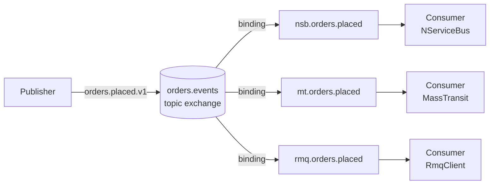

# ADR-0003: Topic exchange for events, header type routing

## Status

Accepted

## Context

Events must be deliverable to an arbitrary number of independent consumer queues simultaneously. Commands must route to exactly one queue. A shared wire format is needed so all three consumer frameworks can read the same message bytes.

## Decision

Use a **topic exchange** (`orders.events`) for all domain events with routing keys that carry the message type and schema version (e.g. `orders.placed.v1`). Use **direct exchanges** for commands (`orders.commands`) and queries (`orders.queries`). Embed a custom `x-message-type` header with the CLR fully-qualified type name on every published message so consumers can deserialize without framework-specific envelopes.

## Consequences

- Any number of consumers can independently receive every event.
- Adding a new consumer requires only declaring a new queue and binding — no publisher changes.
- The `x-message-type` header adds a small serialization contract: CLR type names must remain stable across deploys.
