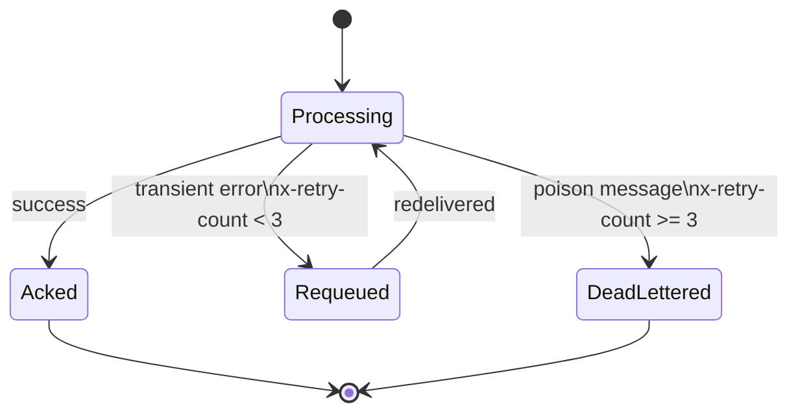

# ADR-0005: Quorum queues + dead-letter exchange

## Status

Accepted

## Context

Classic mirrored queues are deprecated in RabbitMQ 3.12+. Poison messages that cannot be processed must not be lost silently or cause infinite requeue loops.

## Decision

Declare all consumer queues as **quorum queues** (`x-queue-type: quorum`) for durability and leader election. Each queue has a corresponding dead-letter queue (`<name>.dlq`) bound to a global `dlx` direct exchange. After 3 failed delivery attempts the raw RmqClient consumer nacks without requeue, causing RabbitMQ to dead-letter the message.

## Consequences

- Poison messages are preserved for inspection rather than dropped.
- Quorum queues require RabbitMQ 3.8+ with a 3-node cluster for full durability guarantees (single node in dev is fine).
- Each consumer service must declare its own DLQ at startup via `TopologyInitializer.DeclareQueueAsync`.
