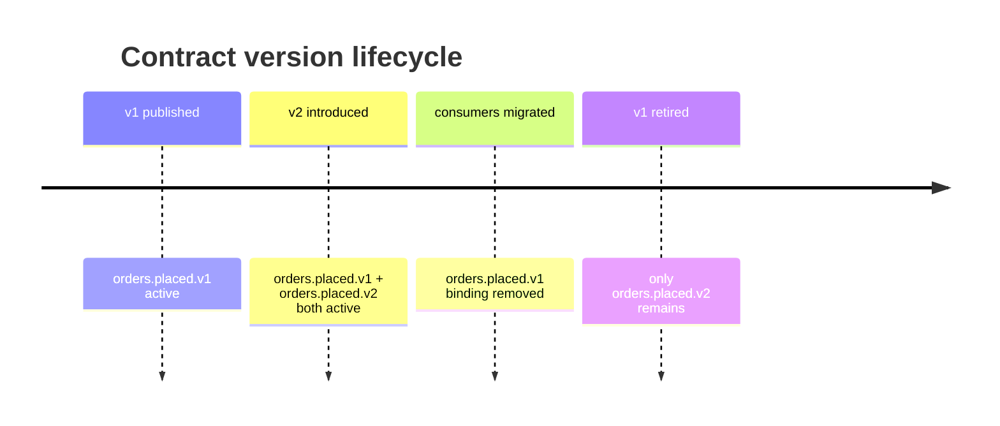

# ADR-0008: Versioning via routing key suffix

## Status

Accepted

## Context

Contract schemas evolve. Adding a field is non-breaking; removing or renaming one is breaking. Consumers bound to the old routing key must continue to receive messages during a migration window.

## Decision

Embed the schema version in the routing key as a `.vN` suffix (e.g. `orders.placed.v1`). The `[ContractVersion]` attribute and `ContractVersions` constants provide a single source of truth. When a breaking change is introduced, a new routing key (`orders.placed.v2`) is published alongside the old one during the transition period. Consumers migrate independently.

A breaking change is any of:
- Removing or renaming a property on an existing contract record
- Removing or renaming a contract record type
- Removing or renaming a routing key or exchange constant in `Messaging.Contracts.Topology`

## Consequences

- Zero-downtime migrations are possible: old and new versions coexist.
- Publisher must publish to both routing keys during the transition period.
- The routing key suffix makes version visible in the RabbitMQ management UI without inspecting message bodies.
- Breaking changes must follow the Conventional Commits `feat(contracts)!` format with a `BREAKING CHANGE:` footer.
