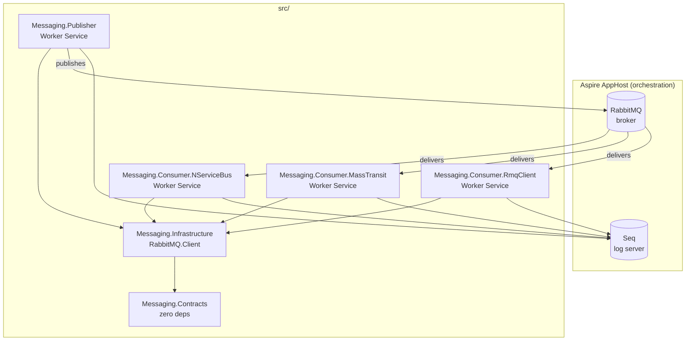

# Architecture Decision Records

This directory contains Architecture Decision Records (ADRs) for the Messaging solution, written in [MADR format](https://adr.github.io/madr/).

## Architecture overview

## Index

| ADR | Title | Status |
|-----|-------|--------|
| [ADR-0000](0000-template.md) | Template | — |
| [ADR-0001](0001-agnostic-contract-package.md) | Broker-agnostic contract package | Accepted |
| [ADR-0002](0002-rabbitmq-sole-broker.md) | RabbitMQ as sole broker | Accepted |
| [ADR-0003](0003-topic-exchange-header-type-routing.md) | Topic exchange + header type routing | Accepted |
| [ADR-0004](0004-central-package-management.md) | Central package management | Accepted |
| [ADR-0005](0005-quorum-queues-dead-letter.md) | Quorum queues + dead-letter exchange | Accepted |
| [ADR-0006](0006-aspire-local-orchestration.md) | Aspire for local orchestration | Accepted |
| [ADR-0007](0007-system-text-json-serialization.md) | System.Text.Json serialization | Accepted |
| [ADR-0008](0008-versioning-routing-key-suffix.md) | Versioning via routing key suffix | Accepted |
